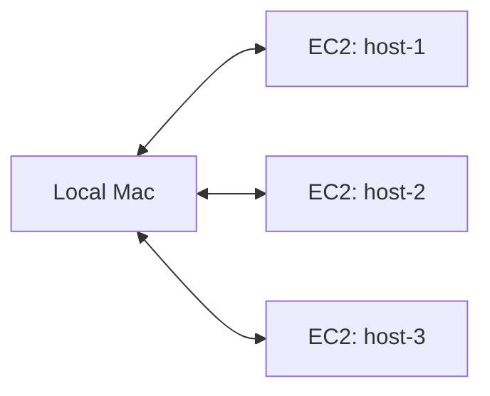

# Unison Heartbeat

Sync local directories with remote hosts via Unison, with heartbeat-based health detection and auto-start on macOS.

**Run once and done.** Installs a macOS LaunchAgent that starts automatically on login. No need to keep a terminal open or re-run after laptop restarts.



## What This Does

Unison is great for bidirectional file sync, but long-running Unison processes can silently hang when SSH connections drop or remote hosts become unreachable. This tool wraps Unison with:

- **Heartbeat monitoring**: Detects stuck syncs by checking log file activity, not just process status
- **Auto-restart**: Only restarts the specific sync point that's stuck, leaving healthy ones alone
- **macOS LaunchAgent**: Runs as a daemon that starts on login and stays running
- **Log management**: Deletes large log files while preserving logs otherwise

## How It Works

1. Runs Unison sync processes for each configured sync point
2. Periodically checks if each sync is alive by monitoring log file activity
3. If a sync point is stuck (no log updates), only that sync is restarted
4. Large log files are deleted automatically; logs are preserved otherwise

## Prerequisites

- **Unison**: `brew install unison`
- **Python 3.9+**
- **SSH config**: Remote hosts must be configured in `~/.ssh/config` with key-based auth. You should be able to run `ssh <host>` without entering a password. Example:

```
Host myserver
    HostName 192.168.1.100
    User ubuntu
    IdentityFile ~/.ssh/id_rsa
```

## Usage

```bash
pip install -e .
```

Create `launch.py`:

```python
from unison_heartbeat import start, status, stop

LOG_DIR = "/path/to/logs"
HEARTBEAT_INTERVAL = 60  # seconds between health checks
MAX_LOG_LINES = 1000     # delete logs exceeding this

SYNC_POINTS = [
    {"local_dir": "/local/path", "ssh": "host", "remote_dir": "/remote/path"},
]

if __name__ == "__main__":
    import sys
    cmd = sys.argv[1] if len(sys.argv) > 1 else None
    if cmd == "start":
        start(LOG_DIR, SYNC_POINTS, HEARTBEAT_INTERVAL, MAX_LOG_LINES)
    elif cmd == "status":
        status(LOG_DIR, SYNC_POINTS, HEARTBEAT_INTERVAL)
    elif cmd == "stop":
        stop(LOG_DIR, SYNC_POINTS)
```

Run:

```bash
python launch.py start   # Install LaunchAgent and start syncing
python launch.py status  # Check daemon and sync health
python launch.py stop    # Stop and clean up
```

**Run once and done.** The `start` command installs a macOS LaunchAgent that runs automatically on login. No need to keep a terminal open or re-run after laptop restarts.
