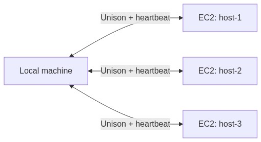

# Unison Heartbeat

Bidirectional file sync via Unison with heartbeat-based health detection. Auto-detects platform: macOS (LaunchAgent) or Linux (systemd user service).



## What This Does

Long-running Unison processes can silently hang when SSH connections drop. This tool wraps Unison with:

- **Heartbeat monitoring**: Detects stuck syncs by writing a heartbeat file and checking log activity
- **Auto-restart**: Restarts only the stuck sync point, leaving healthy ones alone
- **Persistent background service**: LaunchAgent on macOS, systemd user service on Linux
- **Log management**: Deletes large log files automatically

## Prerequisites

- **Unison**: `brew install unison` (macOS) or `apt install unison` (Linux)
- **Python 3.9+**
- **SSH config**: Hosts in `~/.ssh/config` with key-based auth (passwordless `ssh <host>`)

## Usage

```bash
pip install -e .
```

Create a config file (see `sync.example.json`):

```json
{
    "unison_log_dir": "/tmp/unison-logs",
    "heartbeat_interval": 60,
    "max_log_lines": 1000,
    "sync_points": [
        {"local_dir": "/home/ubuntu/workspace", "ssh": "devbox", "remote_dir": "/home/ubuntu/workspace"}
    ]
}
```

```bash
python unison.py start --config sync.json
python unison.py status
python unison.py stop
python unison.py force_start --config sync.json
```

Optional: set `"timezone": "America/New_York"` to control log timestamps (defaults to Eastern Time).

Platform is detected automatically. Config is saved to `~/.unison/heartbeat-config.json` on `start`, so `status` and `stop` need no arguments.

`force_start` wipes `~/.unison/` locally and on every remote host (removing all archives, locks, and profiles), then starts fresh. Use this when sync state is corrupted or you want a full reconciliation from scratch.

## Platform Details

**macOS** — LaunchAgent at `~/Library/LaunchAgents/com.user.unison-sync.plist`. Logs to `<unison_log_dir>/launchd-stdout.log`.

**Linux** — Background daemon with PID file at `~/.unison/unison-sync.pid`. Logs to `~/.unison/unison-sync.log`.
