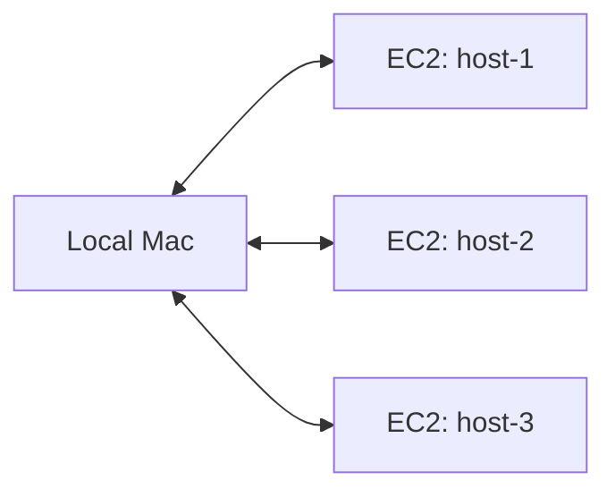

# Unison Heartbeat

Sync local directories with remote hosts via Unison, with heartbeat-based health detection. Supports macOS (LaunchAgent daemon) and Linux (foreground mode).


```mermaid
flowchart LR
    Mac[Local Mac]
    Mac <--> EC2-1[EC2: host-1]
    Mac <--> EC2-2[EC2: host-2]
    Mac <--> EC2-3[EC2: host-3]
```

## What This Does

Unison is great for bidirectional file sync, but long-running Unison processes can silently hang when SSH connections drop or remote hosts become unreachable. This tool wraps Unison with:

- **Heartbeat monitoring**: Detects stuck syncs by checking log file activity, not just process status
- **Auto-restart**: Only restarts the specific sync point that's stuck, leaving healthy ones alone
- **macOS LaunchAgent**: Runs as a daemon that starts on login and stays running
- **Linux foreground mode**: Run in tmux/screen, stop with Ctrl+C
- **Log management**: Deletes large log files while preserving logs otherwise

## How It Works

1. Runs Unison sync processes for each configured sync point
2. Periodically checks if each sync is alive by monitoring log file activity
3. If a sync point is stuck (no log updates), only that sync is restarted
4. Large log files are deleted automatically; logs are preserved otherwise

## Prerequisites

- **Unison**: `brew install unison` (macOS) or `apt install unison` (Linux)
- **Python 3.9+**
- **SSH config**: Remote hosts must be configured in `~/.ssh/config` with key-based auth. You should be able to run `ssh <host>` without entering a password. Example:

```
Host myserver
    HostName 192.168.1.100
    User ubuntu
    IdentityFile ~/.ssh/id_rsa
```

## Usage

```bash
pip install -e .
```

Create a JSON config file (`sync.json`):

```json
{
    "unison_log_dir": "/tmp/unison-logs",
    "heartbeat_interval": 60,
    "max_log_lines": 1000,
    "sync_points": [
        {"local_dir": "/home/ubuntu/project", "ssh": "devbox", "remote_dir": "/home/ubuntu/project"}
    ]
}
```

Run with `--mode foreground` (blocks, Ctrl+C to stop — use tmux or screen):

```bash
python unison.py --mode foreground start --config sync.json
python unison.py --mode foreground status --config sync.json
python unison.py --mode foreground stop --config sync.json
```

Or `--mode launchagent` on macOS (installs a daemon that persists across login):

```bash
python unison.py --mode launchagent start --config sync.json
```

See `sync.example.json` for a config template.
